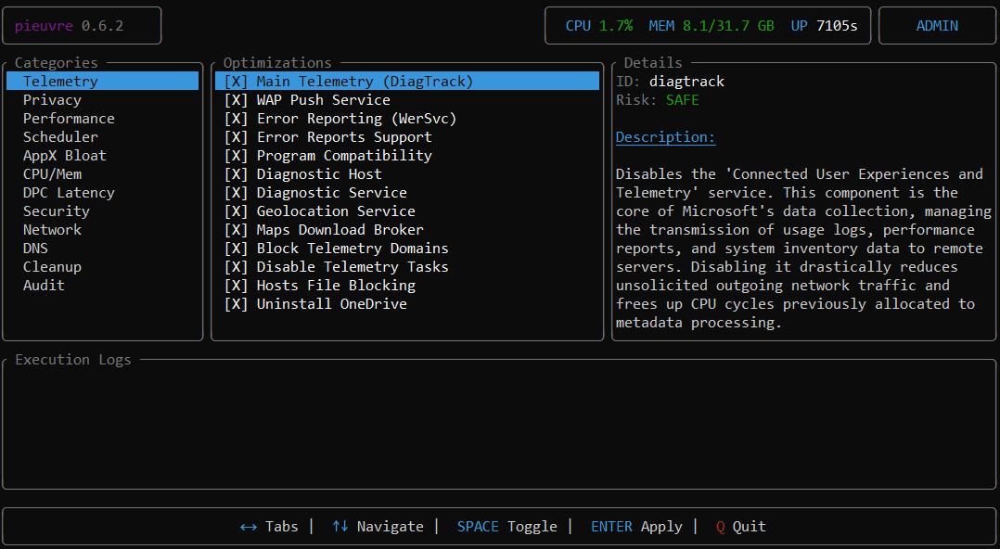

<p align="center">
  
</p>

<h1 align="center">pieuvre</h1>

<p align="center">
  <strong>Advanced Windows 11 System Alignment & Optimization Toolkit</strong>
</p>

<p align="center">
  pieuvre is a high-performance system control utility built in Rust, designed for power users and system administrators who require granular control over Windows internals. It provides a safe, snapshot-based approach to system hardening and performance tuning.
</p>

<p align="center">
  
  
  
  
</p>

---

<p align="center">
  
</p>

## Core Philosophy

Unlike traditional batch scripts or opaque registry tweaks, pieuvre follows a rigorous engineering approach:

- **Native API Integration**: Direct interaction with Windows APIs (Win32, NT) for atomic operations.
- **Audit-First Methodology**: Comprehensive system state analysis before any modification.
- **Persistence & Safety**: Automatic `zstd`-compressed snapshots with SHA256 integrity for reliable rollbacks.
- **Hardware-Aware**: Optimizations are dynamically tailored based on detected hardware (CPU topology, GPU VRAM, Storage type).
- **Asynchronous Execution**: Non-blocking TUI powered by `tokio` for real-time feedback and metrics.

---

## Key Features

### 1. Interactive Dashboard (TUI)
A premium terminal interface featuring:
- **Real-time Metrics**: Live CPU, RAM, and Uptime monitoring.
- **Sidebar Navigation**: Categorized optimization modules for efficient workflow.
- **Async Logging**: Real-time execution feedback with detailed status reporting.

### 2. System Hardening & Privacy
- **Telemetry Neutralization**: Multi-level blocking (Services, Registry, Firewall, Hosts).
- **AI & Recall Blocking**: Complete disabling of Windows Recall and CoPilot integrations.
- **Security Audit**: Deep inspection of Defender, SecureBoot, and VBS status.

### 3. Performance Engineering
- **Latency Optimization**: Timer resolution forcing (0.5ms), MSI mode migration, and DPC/ISR tuning.
- **Hardware Tuning**: Core parking management, memory compression control, and GPU scheduling.
- **Network Stack**: Nagle algorithm disabling and interrupt moderation adjustments.

---

## Installation

### Prerequisites

- **OS**: Windows 10/11 (64-bit)
- **Toolchain**: Rust 1.75+
- **Privileges**: Administrator access required for system modifications.

### Build from Source

```powershell
git clone https://github.com/FeelTheFonk/pieuvre.git
cd pieuvre
cargo build --release
```

The compiled binary will be located at `target/release/pieuvre.exe`.

---

## Quick Start

> [!CAUTION]
> Always perform a full audit before applying optimizations. pieuvre creates snapshots automatically, but manual verification is recommended.

```powershell
# 1. Analyze current system state
pieuvre audit --full

# 2. Launch the interactive dashboard (Recommended)
pieuvre interactive

# 3. Rollback to the last known good state if necessary
pieuvre rollback --last
```

---

## Command Reference

| Command | Description |
|:---|:---|
| `audit` | Comprehensive system inspection and report generation. |
| `interactive` | Premium TUI for granular optimization selection. |
| `status` | Display current system alignment and applied tweaks. |
| `verify` | Integrity check of applied changes with repair capabilities. |
| `rollback` | Restore system state from a previous snapshot. |

---

## Documentation

- [**Architecture**](docs/ARCHITECTURE.md): Deep dive into the workspace structure and data flow.
- [**Technical Details**](docs/TECHNICAL.md): Implementation specifics of the optimization modules.
- [**CLI Reference**](crates/pieuvre-cli/README.md): Detailed command-line arguments and usage.
- [**Contributing**](CONTRIBUTING.md): Guidelines for development and code standards.

---

## License

Licensed under either of [Apache License, Version 2.0](LICENSE-APACHE) or [MIT license](LICENSE-MIT) at your option.
