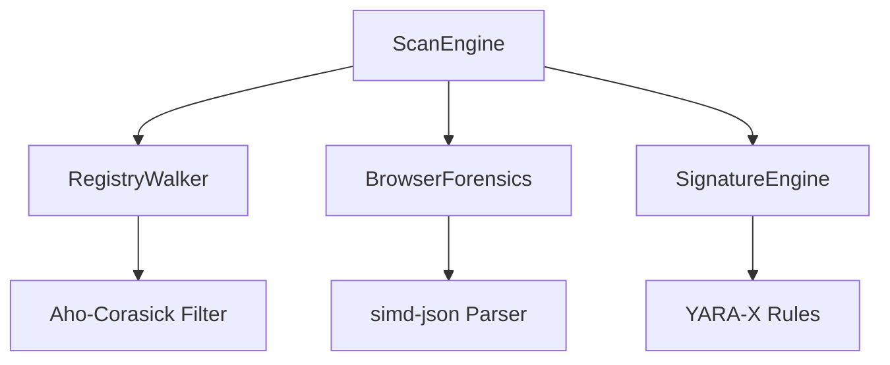

# pieuvre-scan (SOTA v0.8.0)

Moteur unifié de détection et de forensique haute performance pour Windows 11.

## Capacités SOTA

### 1. Visibilité Système Totale
- **SeDebugPrivilege** : Acquisition automatique des privilèges de débogage pour inspecter les processus protégés et les ruches de registre restreintes.
- **Native API** : Utilisation exclusive de `windows-sys` pour minimiser l'overhead et maximiser la vitesse d'exécution.

### 2. Moteur de Détection Multi-Niveaux
- **Phase Blitz (Aho-Corasick)** : Pré-filtrage ultra-rapide des chemins et clés de registre via l'algorithme d'Aho-Corasick.
- **Deep Scan (YARA-X)** : Analyse comportementale et par signatures via l'implémentation Rust native de VirusTotal.
- **Forensique Navigateur** :
    - **Chrome/Edge** : Analyse des politiques d'entreprise (`ExtensionInstallForcelist`) et des préférences via `simd-json`.
    - **Firefox** : Analyse de `user.js` et des extensions tierces (`foreignInstall`).

### 3. Performance "Climax"
- **Zero-Copy Parsing** : Utilisation de `simd-json` pour le traitement des fichiers de configuration volumineux.
- **Parallélisme Massif** : Itération du système de fichiers et analyse des signatures via `rayon` et `tokio`.

## Architecture



## Utilisation

Le module est intégré au CLI principal de Pieuvre :
```powershell
pieuvre interactive  # Menu Scan
pieuvre tweak apply scan_yara
```
