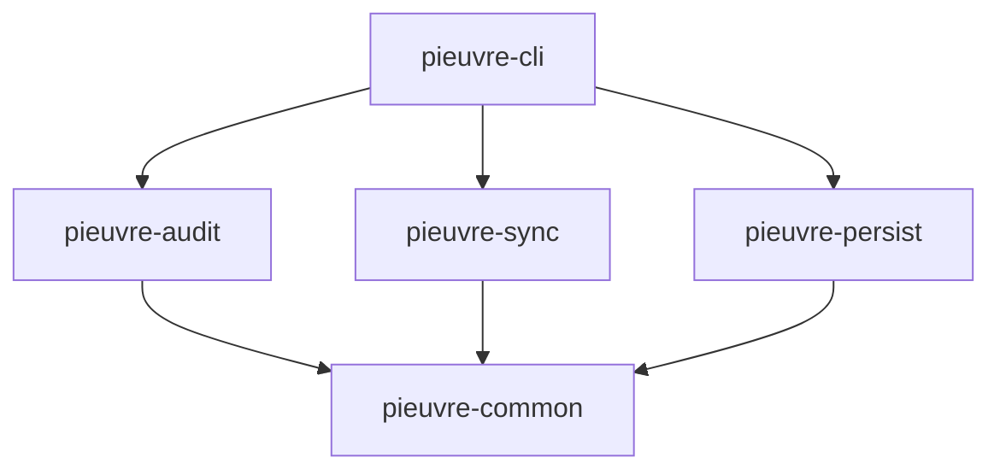
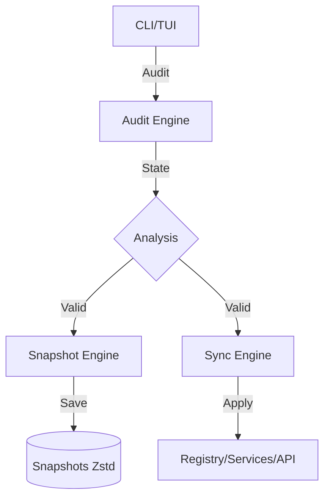

# Architecture

Architecture du workspace pieuvre et flux de données.

---

## Structure du Workspace

```
pieuvre/
├── crates/
│   ├── pieuvre-common/     Types partagés, erreurs et utilitaires
│   ├── pieuvre-audit/      Moteur d'inspection système (Read-only)
│   ├── pieuvre-sync/       Moteur de modification et d'optimisation
│   ├── pieuvre-persist/    Gestion des snapshots et rollbacks
│   └── pieuvre-cli/        Interface CLI et dashboard TUI
├── config/
│   ├── default.toml        Configuration par défaut
│   └── telemetry-domains.txt
└── docs/
    ├── ARCHITECTURE.md     Ce fichier
    └── TECHNICAL.md        Détails d'implémentation
```

---

## Dépendances



---

## Principes

- **User-Mode (Rust)** : Orchestration, snapshots compressés (Zstd).
- **Audit-First** : Analyse d'état avant modification.
- **Sécurité** : Persistence automatique de l'état.

### Flux de Données



---

## Architecture TUI

Modèle basé sur des composants pour la gestion de l'interface.

### Modèle de Composant
Chaque vue implémente le trait `Component`. Le rendu est orchestré par une boucle centrale dans `ui.rs`.

### Navigation
Pile de navigation (`nav_stack`) pour l'exploration hiérarchique.

### HUD
Logs et métriques gérés en overlays.

---

## Modèle d'Exécution Asynchrone

- **Tokio Tasks** : Opérations lourdes en arrière-plan.
- **MPSC Channels** : Transmission des logs et statuts.
- **Event Loop** : Gestion non-bloquante des événements clavier et rendu Ratatui.

---

## Responsabilités des Crates

### pieuvre-common
- `PieuvreError` : Gestion centralisée des erreurs.
- Structures et types partagés.
- Parsing de configuration.

### pieuvre-audit
- **Hardware** : CPU, RAM, GPU (via DXGI).
- **Services** : Énumération via Native API.
- **Télémétrie** : Inspection de 40+ clés.
- **AppX** : Inventaire des packages.
- **ETW** : Monitoring DPC/ISR en temps réel.

### pieuvre-sync
Modules d'optimisation :
- `services.rs` : Gestion d'état des services.
- `timer.rs` : `NtSetTimerResolution` (0.5ms).
- `power.rs` : Configuration des plans d'alimentation.
- `firewall.rs` : Injection de règles de pare-feu.
- `msi.rs` : Gestion MSI Mode.
- `registry.rs` : Opérations atomiques sur le registre.
- `appx.rs` : Suppression de packages AppX.
- `hosts.rs` : Blocage via fichier hosts.
- `hardening.rs` : ACLs et protection IFEO.
- `sentinel/` : Surveillance des changements non autorisés.

### pieuvre-persist
- **Snapshots** : Capture d'état pré-modification.
- **Rollback** : Restauration avec vérification d'intégrité.
- **Compression** : `zstd`.
- **Intégrité** : SHA256.

### pieuvre-cli
- **Parsing** : `clap`.
- **Interface** : Dashboard TUI.
- **Command Registry** : Mapping IDs vers `TweakCommand`.
- **Orchestration** : Coordination des moteurs.

---

## Command Pattern

Découplage de la logique d'exécution :
- Trait `TweakCommand` : Interface d'exécution atomique.
- `CommandRegistry` : Registre centralisé des tweaks.
- `ExecutionResult` : Feedback standardisé.
