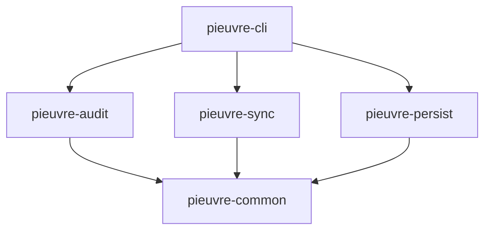
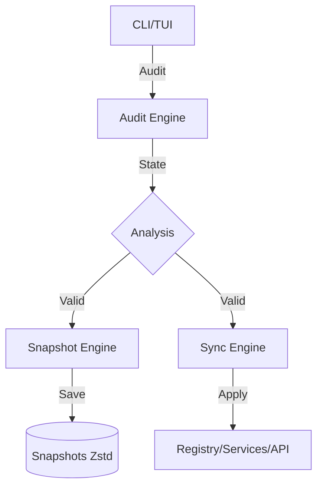

# Architecture

pieuvre workspace architecture and data flow.

---

## Workspace Structure

```
pieuvre/
├── crates/
│   ├── pieuvre-common/     Shared types, error handling, and utilities
│   ├── pieuvre-audit/      Read-only system inspection engine
│   ├── pieuvre-sync/       System modification and optimization engine
│   ├── pieuvre-persist/    Snapshot management and rollback logic
│   └── pieuvre-cli/        Command-line interface and TUI dashboard
├── config/
│   ├── default.toml        Default configuration
│   └── telemetry-domains.txt
└── docs/
    ├── ARCHITECTURE.md     This file
    └── TECHNICAL.md        Technical implementation details
```

---

## Crate Dependencies



---

## Core Principles

- **User-Mode (Rust)**: Orchestration, compressed snapshots (Zstd), and high-performance CLI/TUI.
- **Audit-First**: Every modification is preceded by a comprehensive system state analysis.
- **Safety**: Automatic state persistence before any system change.

### Data Flow



---

## TUI Architecture (v0.6.0+)

The user interface follows a **Component-Based** model for maximum fluidity and clarity.

### Component Model
Each view is an autonomous component implementing the `Component` trait. Rendering is orchestrated by a central loop in `ui.rs` that distributes rendering zones (`Rect`) to components.

### Navigation Drill-down
The system uses a navigation stack (`nav_stack`) allowing for deep hierarchical exploration without cognitive overload.

### HUD Mode
Logs and metrics are managed as overlays to maximize the useful workspace.

---

## Asynchronous Execution Model

The Dashboard utilizes an asynchronous communication model to guarantee a fluid UI (60 FPS):
- **Tokio Tasks**: Heavy operations are offloaded to background tasks.
- **MPSC Channels**: Execution logs and statuses are transmitted via asynchronous channels.
- **Event Loop**: Non-blocking management of keyboard events and Ratatui rendering via a centralized `Store`.

---

## Crate Responsibilities

### pieuvre-common

- `PieuvreError`: Centralized error handling.
- Shared structures and types.
- Configuration parsing and validation.

### pieuvre-audit

- **Hardware Detection**: CPU topology, RAM, and GPU (via DXGI).
- **Service Enumeration**: Direct interaction with Native APIs.
- **Telemetry Detection**: Deep inspection of 40+ telemetry-related keys.
- **AppX Inventory**: Package analysis for cleanup.
- **ETW Engine**: Real-time DPC/ISR monitoring with `DriverResolver`.
- **Read-only**: Strictly guaranteed to never modify the system state.

### pieuvre-sync

30+ optimization modules including:
- `services.rs`: Service state management (Native API).
- `timer.rs`: `NtSetTimerResolution` (0.5ms) for latency reduction.
- `power.rs`: Atomic power plan configuration.
- `firewall.rs`: Native firewall rule injection.
- `msi.rs`: MSI Mode migration and management.
- `registry.rs`: Atomic registry operations.
- `appx.rs`: AppX package removal.
- `hosts.rs`: High-performance hosts file blocking.
- `hardening.rs`: System hardening and IFEO protection.
- `interrupts.rs`: Dynamic interrupt affinity steering.
- `sentinel/`: System monitoring engine for unauthorized changes.

### pieuvre-persist

- **Snapshot Creation**: State capture before modifications.
- **Rollback**: Restoration to any previous state with integrity checks.
- **Compression**: `zstd` compression for minimal storage footprint.
- **Integrity**: SHA256 hashing for snapshot verification.

### pieuvre-cli

- **Command Parsing**: Powered by `clap`.
- **Interactive Mode**: Premium TUI dashboard.
- **Orchestration**: Coordination between audit, sync, and persist engines.
