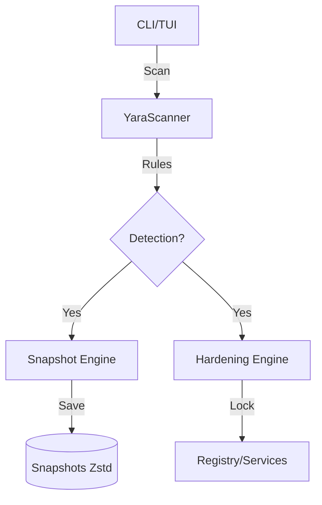

# Architecture

pieuvre workspace architecture and data flow.

---

## Workspace Structure

```
pieuvre/
├── crates/
│   ├── pieuvre-common/     Shared types, error handling
│   ├── pieuvre-audit/      Read-only system inspection
│   ├── pieuvre-sync/       System modification functions
│   ├── pieuvre-persist/    Snapshot and rollback
│   └── pieuvre-cli/        Command-line interface
├── config/
│   ├── default.toml        Default configuration
│   └── telemetry-domains.txt
└── docs/
    ├── ARCHITECTURE.md     This file
    └── TECHNICAL.md        Technical implementation details
```

---

## Crate Dependencies

```
pieuvre-cli
    ├── pieuvre-audit
    │   └── pieuvre-common
    ├── pieuvre-sync
    │   └── pieuvre-common
    └── pieuvre-persist
        └── pieuvre-common
```

---

- **User-Mode (Rust)** : Orchestration, détection YARA, snapshots compressés (Zstd), interface CLI/TUI.

### Data Flow



---

## Architecture TUI (v0.6.0+)

L'interface utilisateur a été refactorisée vers un modèle **Component-Based** pour une fluidité et une clarté maximales.

### Component Model
Chaque vue est un composant autonome implémentant le trait `Component`. Le rendu est orchestré par une boucle centrale dans `ui.rs` qui distribue les zones de rendu (`Rect`) aux composants.

### Navigation Drill-down
Le système utilise une pile de navigation (`nav_stack`) permettant une exploration hiérarchique profonde sans surcharge cognitive.

### HUD Mode
Les logs et métriques sont gérés en surimpression (Overlay) pour maximiser l'espace de travail utile.

---

## Asynchronous Execution Model

Le Dashboard utilise un modèle de communication asynchrone pour garantir une UI fluide (60 FPS) :
- **Tokio Tasks** : Les opérations lourdes sont déportées dans des tâches de fond.
- **MPSC Channels** : Les logs et statuts d'exécution sont transmis via des canaux asynchrones.
- **Event Loop** : Gestion non-bloquante des événements clavier et du rendu Ratatui via un `Store` centralisé (Phase 2).

---

## Crate Responsibilities

### pieuvre-common

- `PieuvreError` enum for all error types
- Shared structures and types
- Configuration parsing

### pieuvre-audit

- Hardware detection (CPU, RAM, GPU via DXGI)
- Service enumeration (Native API)
- Telemetry level detection (40+ keys)
- AppX package inventory
- **ETW Engine**: Real-time DPC/ISR monitoring with `DriverResolver`
- **Read-only**: never modifies system state

### pieuvre-sync

30+ optimization modules:
- `services.rs` - Service state management (Native API)
- `timer.rs` - `NtSetTimerResolution` (0.5ms)
- `power.rs` - Power plan configuration (Native API)
- `firewall.rs` - Firewall rule injection (Native API)
- `msi.rs` - MSI Mode detection/enabling
- `registry.rs` - Atomic registry writes
- `appx.rs` - AppX package removal
- `hosts.rs` - Hosts file blocking
- `scheduled_tasks.rs` - Task disabling (Native API)
- `onedrive.rs` - OneDrive removal
- `context_menu.rs` - Context menu cleanup
- `widgets.rs` - Widget disabling
- `windows_update.rs` - Update control
- `edge.rs` - Edge management
- `explorer.rs` - Explorer tweaks
- `game_mode.rs` - Game mode configuration
- `network.rs` - Network optimizations
- `security.rs` - VBS/HVCI/Memory Integrity
- `dpc.rs` - DPC latency optimizations
- `cpu.rs` - Core Parking/Memory
- `hardening.rs` - **System Hardening & IFEO Protection**
- `interrupts.rs` - **Dynamic Interrupt Affinity Steering**
- `sentinel/` - **System Monitoring Engine** (v0.4.0: Service Monitoring)
- `power_plan.rs` - Atomic Power Plan operations (MsiOperation, AppxOperation)

### pieuvre-persist

- Snapshot creation before modifications
- Rollback to any previous state
- Change record tracking
- JSON export

### pieuvre-cli

- Command parsing (clap)
- Interactive mode (dialoguer)
- System state capture
- ETW analysis
